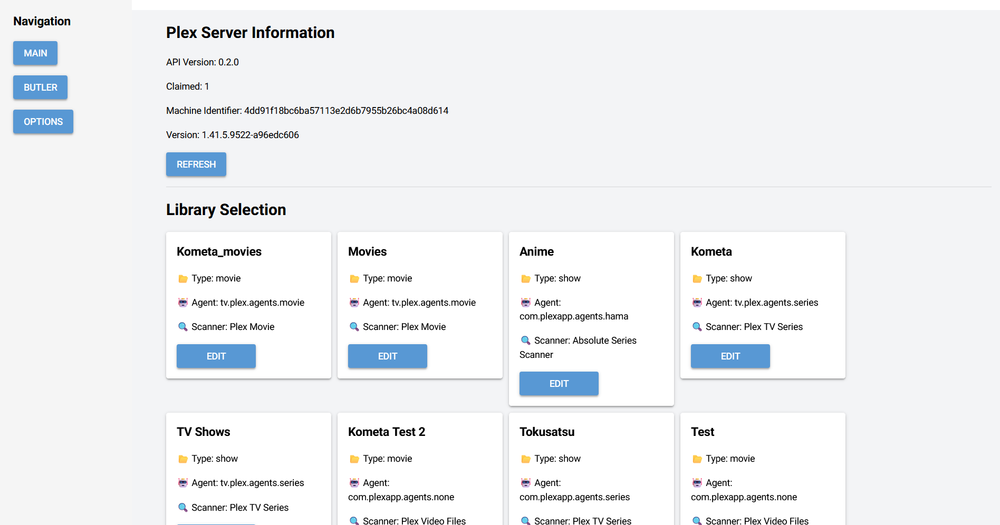

# Unofficial Plex Manager

## Overview
Unofficial Plex Manager is a tool designed to help users edit and manage metadata for their Plex library content easily. The application provides a streamlined interface for modifying metadata, ensuring a well-organized and visually appealing media collection. Additionally, it includes a feature to run Plex Butler tasks, allowing users to automate maintenance and optimization tasks for their library.

## Features
- **Library Content Metadata Editor**: Modify titles, descriptions, ratings, and other metadata fields directly.
- **Plex Butler Task Runner**: Execute and automate various maintenance tasks for your Plex library.
- **User-Friendly Interface**: Simple and intuitive UI, just fill the field you want to edit.
- **Docker Support**: Run the application effortlessly using Docker.


## Installation
### Requirements
- Python 3.11+
- Plex Media Server
- Docker (optional, see below)

### Setup
1. Clone the repository:
   ```bash
   git clone https://github.com/van-geaux/unofficial_plex_manager.git
   cd plex-metadata-manager
   ```
2. Install dependencies:
   ```bash
   pip install -r requirements.txt
   ```
3. Run the application:
   ```bash
   python main.py
   ```

## Docker
```bash
docker run --rm \
  -e PLEX_URL='http://plex_ip:port' \
  -e PLEX_TOKEN='super-secret-token' \
  -p 8080:8080 \
  ghcr.io/van-geaux/unofficial_plex_manager:latest
```

## Docker Compose
```yaml
services:
  plex-nfo-exporter:
    image: ghcr.io/van-geaux/unofficial_plex_manager:latest
    environment:
      - PLEX_URL='http://plex_ip:port'
      - PLEX_TOKEN='super-secret-token'
    ports:
      - "8080:8080"
```

## Usage
1. Open the application in your browser.
2. Connect to your Plex server using your API key.
3. Modify metadata fields as needed.
4. Save changes and apply them to your Plex library.
5. (Optional) Run Plex Butler tasks to automate maintenance operations.

## Environment Variables
| Variable    | Description              | Default |
|------------|--------------------------|---------|
| `PLEX_URL` | Plex server URL          | None    |
| `PLEX_TOKEN` | Plex API authentication token | None    |

## TODO
- Authentication?
- Darkmode, tought it's supposed to be easy but I botched my attempts
- Edits logs
- Poster/art upload?

## Contributing
Pull requests are welcome! Please open an issue for any feature requests or bug reports.

## License
This project is licensed under the General Public License. See `LICENSE` for details.

## More Screenshot



